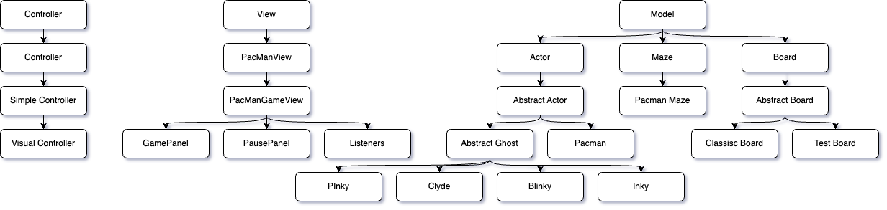

# PacMan Project Report

## Group Members

- Leo Jourdain
- Jaffar Gura
- Mapathe Faye

## Introduction

The primary goal of our PacMan project was to build a replica of the classic game, following specific guidelines provided by our professors. We chose Java as our programming language due to its robustness and object-oriented features, which are ideal for game development. For the graphical interface, we utilized Swing, a Java library that provides a set of lightweight components for building graphical user interfaces.

A significant focus of our project was on replicating the Ghost AI to simulate the movements and hunting patterns seen in the original PacMan game. This challenge allowed us to delve into more complex programming concepts and AI strategies. Additionally, we dedicated considerable effort to creating an engaging and responsive user interface, enhancing the overall gameplay experience.

## Implementation

### Progress of the Project

Our team has successfully implemented several core aspects of the PacMan game. We have set up the game board and maze, implemented the movements for PacMan, and created the ghosts along with their targeting systems. Currently, the game features Scatter and Chase modes, which function relatively well. PacMan's movements are smooth, and the game board loads correctly, which are significant achievements in our project.

However, there are still areas that require further development. The Frightened mode for the ghosts is not yet complete, causing the movements of Pinky, Inky, and Clyde to sometimes appear erratic. This issue highlights a need for more precise algorithms to manage ghost behaviors across different game modes.

Additionally, while the basic framework for the user interface is in place, elements such as Pausing the Game, Game End, and Level Over functionalities are operational but unfinished. Our goal is to enhance these aspects to ensure a fully functional and visually appealing interface.

### Class Structure and Hierarchy

## Tests

Our project's testing phase has seen varied success across different levels of complexity. The tests designed for Level 1 and Level 2 of our game are fully passing, which validates the fundamental mechanics of PacMan's movements and the basic ghost interactions. These initial tests have been crucial in establishing a stable foundation for further development.

However, as we progressed to more complex scenarios in Level 3 and Level 4, the outcomes became mixed. While some tests in these levels are passing, others are not, indicating inconsistencies particularly in advanced game mechanics and ghost behaviors. We have not added any new tests but have extensively utilized debug statements and breakpoints to dissect and understand the failing tests. This approach has helped us identify specific issues but also highlighted areas where our game's logic can be complex and challenging to manage.

## Work Organization

### Division of Labor

Léo took charge of many of the game's key technical aspects, including the implementation of the maze and the game board. He also worked on the movement mechanics for PacMan and the ghosts, as well as managing the game controller, ensuring fluid interaction for users. Jaffar doubled up on implementing the game board with Leo, also focusing on PacMan and ghost movement. His role extended to the graphic aspect of the game, where he set up the visual interface, and he also took part in controller management, ensuring consistency between the interface and the control mechanisms. Mapathé played a key role in the implementation of the labyrinth and collaborated on the development of the game board. It also made a significant contribution to the graphics, ensuring that the game's aesthetic was attractive and engaging for players. Each member brought complementary skills that enriched the project.

### Team Coordination

Our team utilized GitHub for version control, a tool with which we were already familiar. This choice allowed us to effectively manage our project's codebase, track changes, and collaborate seamlessly. GitHub's features enabled us to review each other's contributions, merge code without conflicts, and maintain a consistent development workflow throughout the project.

## Reflection

### Progress

*Pending reflection on progress made.*

### Challenges

One of the primary challenges we faced was mentally visualizing the maze and the movements within it, particularly when debugging the code. This issue became pronounced as we tried to understand and optimize the movement and targeting functions of both PacMan and the ghosts.

To effectively address this, our team developed a practical approach by creating physical layouts of both the test board configuration and the classic PacMan board. We used these layouts as references on paper, which significantly aided our debugging process. This hands-on method allowed us to trace and plan our functions more clearly, helping us better understand the underlying mechanics and the potential pitfalls of our algorithms.

  
  

## Conclusion

Overall, our team has greatly enjoyed working on the PacMan project. While we are proud of what we have achieved, given more time and fewer competing commitments, we believe we could have produced an even more complete and functional game. Nonetheless, we plan to continue working on the project after its official conclusion to achieve a sense of accomplishment from fully building our own game.

Throughout this project, we have gained invaluable skills in adapting and debugging code. The use of breakpoints, print statements, and conditional breakpoints has taught us new ways to step through our code effectively. This practical experience has been crucial in enhancing our debugging techniques.

Collaboratively, we learned significant lessons about teamwork and project management, particularly in the context of a complex software development project. Additionally, our efforts to render game layouts have improved, though we acknowledge that there is still much to learn in this area.

Looking forward, our immediate goal is to complete the project by refining the game's structure. We aim to separate concerns more clearly, moving specific methods from individual actor classes to the appropriate abstract classes. This restructuring will streamline our codebase, reduce repetition, and enhance the maintainability of our game.

This project has not only provided us with a deeper understanding of software development and game design but has also strengthened our capabilities to work effectively as a team.
